# PHP/SQL - Premiers pas : formulaire de contact

## Avant d'écrire du PHP

- Dans le répertoire `www` de votre environnement de développement (composé *a minima* d'une distribution **L**inux - en l'occurence Debian si vous avez suivi [mon tuto « Install LAMP in WSL2 »](https://github.com/SolangeHarmoniePICARD/doc_wsl2-debian-fr) -, d'**A**pache, de **M**ariaDB & de **P**HP, **mais aussi de Postfix et de MailDev**), créez un dossier que vous nommerez `feature_contact-form` :

```
mkdir /var/www/feature_contact-form
```

> `/` est le répertoire racine d'une arborescence Linux.
>
> `/var` est le dossier système qui stocke des données variables.
>
> `/var/www` est le répertoire où Apache2 va par défaut chercher les sites et les pages web.

- Positionnez-vous à l'intérieur de ce dossier : 

```
cd /var/www/feature_contact-form
```

- Créez un fichier `index.php` :

```
touch index.php
```

## Les bases : un formulaire en HTML

- Ouvrez `index.php` avec VSCode. Il n'y aura presque pas de PHP dans ce fichier, puisqu'il contiendra notre formulaire, donc principalement du HTML. Toutefois, nous ferons passer des messages de succès ou d'erreurs depuis la page de traitement vers la page de formulaire via une variable superglobale : `$_SESSION`. Le fichier `index.php` doit donc commencer par la fonction PHP `session_start()`. Ouvrez la balise PHP : `<?php`, et fermez là sur la même ligne : `?>`. Entre ces deux balises, écrivez `session_start()` :

**index.php**
```php
<?php session_start(); ?>
```

- Ensuite, ligne 3, générez le `DOCTYPE` en tapant `!` puis en appuyant sur la touche `TAB` de votre clavier dans VSCode+. Personnalisez-le, par exemple en changeant la langue : notre page sera en français, donc changez la valeur de l'attribut `lang="en"` par `lang="fr"`. Entre les balises ouvrantes et fermantes `<title>` et `</title>`, tapez un titre (en français) pour votre page web, par exemple `Formulaire de Contact`. Enfin, rajoutez la très importante balise `meta:desc`. Pour ce faire, sous la balise `meta:viewport`, tapez `meta:desc`, appuyez sur la touche `ENTRÉE` de votre clavier, et rédigez une description en français de votre page web comme valeur à l'attribut `content=""` :

**index.php**
```html
<!DOCTYPE html>
<html lang="fr">
<head>
    <meta charset="UTF-8">
    <meta http-equiv="X-UA-Compatible" content="IE=edge">
    <meta name="viewport" content="width=device-width, initial-scale=1.0">
    <meta name="description" content="Un formulaire de contact en PHP/SQL.">
    <title>Formulaire de Contact</title>
</head>
<body>

</body>
</html>

```

- À l'intérieur des balises HTML ouvrantes et fermantes `<body>` et `</body>`, tapez `form:post` et appuyez sur la touche `ENTRÉE` de votre clavier. Entre les guillemets de l'attribut `action=""` de la balise `form` générée, tapez `handler.php`, qui sera votre page de traitement :

**index.php**
```html
<form action="handler.php" method="post"></form>
```

- Dans votre terminal BASH, créez le fichier `handler.php` en tapant :

```
touch /var/www/feature_contact-form/handler.php
```

- Entre notre balise ouvrante `<form>` et sa balise fermante `</form>`, on va créer trois nouvelles balises. Tout d'abord une balise `label` dont l'attribut `for=""` prendra comme valeur `field-username`. Pour la générer, tapez `label` et appuyez sur la touche `ENTRÉE` de votre clavier, puis renseignez la valeur. Puis, entre la balise ouvrante `<label>` et sa balise fermante `</label>`, tapez `Nom :`. En effet, ce premier champs permettra à l'utilisateur de votre formulaire qui souhaite vous contacter d'indiquer son nom !

**index.php**
```html
<label for="field-username">Name: </label>
```

- Ensuite, créez une balise `input` de type `text`. Tapez `input:text` et appuyez sur la touche `ENTRÉE` de votre clavier. En plus du type, vous remarquez 2 attributs dont il faut renseigner les valeurs. L'attribut `id` doit être le même que l'attribut `for` du `label`, écrivez donc `id="field-username"`. L'attribut `name=""` est autrement plus important. C'est grâce à lui que la variable superglobale `$_POST` qu'on créera dans votre fichier `handler.php` va récupérer les informations rentrées par vos utilisateurs dans les champs de votre formulaire pour effectuer des traitements. L'attribut `name=""` prend donc comme valeur un nom qui va correspondre à la donnée saisie par l'utilisateur. On lui donnera donc comme valeur `name="data-username"`. Vous pouvez rajouter un quatrième attribut, le `placeholder`. C'est cette information dans le champs de formulaire écrite de façon grisée et qui disparaît quand vous placez votre curseur dans le champs, mais qui donne une information supplémentaire à votre utilisateur sur ce qu'il doit renseigner dans ce champs. Vous pouvez par exemple écrire en français « Votre nom » : 

**index.php**
```html
<input type="text" name="data-username" id="field-username" placeholder="Votre nom">
```

- Enfin, on va créer notre troisième `input`, qui ne sera en fait pas un champs de formulaire mais le bouton qui envoie le formulaire à la page de traitement spécifiée dans l'attribut `action=""`. Cet `input` sera de type `submit`, Tapez `input:text` et appuyez sur la touche `ENTRÉE` de votre clavier. Il prend comme attribut `value=""` le mot que vous voulez faire apparaître dans votre bouton. Par exemple le mot français « Envoyer » : 

**index.php**
```html
<input type="submit" value="Envoyer">
```

- Le résultat auquel vous devriez être arrivé : 

**index.php**
```html
<?php session_start(); ?>

<!DOCTYPE html>
<html lang="fr">
<head>
    <meta charset="UTF-8">
    <meta http-equiv="X-UA-Compatible" content="IE=edge">
    <meta name="viewport" content="width=device-width, initial-scale=1.0">
    <meta name="description" content="Un formulaire de contact en PHP/SQL.">
    <title>Formulaire de Contact</title>
</head>
<body>
    
    <form action="handler.php" method="post">
        <label for="field-name">Nom : </label>
        <input type="text" name="data-username" id="field-name" placeholder="Votre nom">
        <input type="submit" value="Envoyez">
    </form>

</body>
</html>
```

- Dans la barre d'URL de votre navigateur, tapez `localhost/feature_contact-form` :

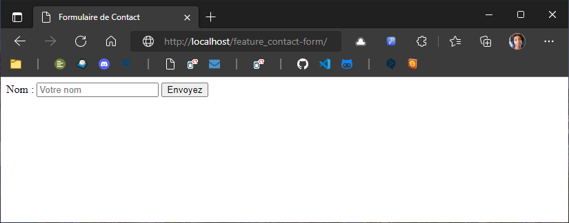

- Et si vous saisissez une information dans votre champs de formulaire et que vous appuyez sur votre bouton « Envoyez », que se passe-t-il ? Testez !

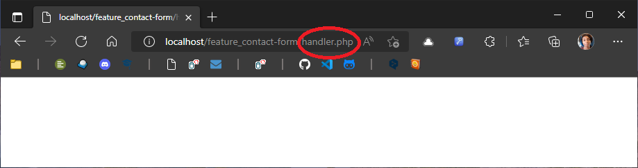

- En apparence, **il ne s'est rien passé**. Vous constatez juste que vous n'êtes plus sur votre page `index.php` et que vous êtes passé dans la page `handler.php`. **Mais c'est en apparence seulement !** Car en réalité... Faites un clic droit dans votre navigateur, et choisissez l'inspecteur dans le menu contextuel :


- Dans l'onglet `Réseau`, cliquez sur `handler.php`. Pour que `handler.php` s'affiche, réactualisez la page ! Entre l'onglet `En-têtes` et l'onglet `Aperçu`, vous avez un onglet dont je ne me souviens plus du nom en français... En anglais c'est `Payload`. Cliquez sur cet onglet. Et là ! La valeur (`data-username`) de l'attribut `name` de votre `input` **et** la donnée saisie par l'utilisateur s'affichent ! Ce qui signifie qu'elle est disponible dans votre page `handler.php`. Reste à apprendre à la manipuler en PHP...

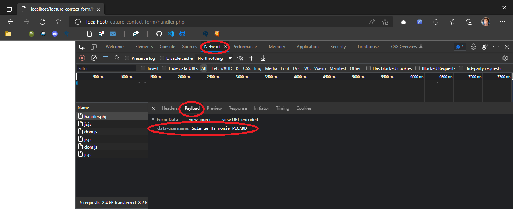


### Un peu de pratique !

> Dans un formulaire de contact, on a besoin de 4 informations :
> - [X] le nom de la personne qui cherche à nous contacter
> - [ ] son adresse email pour pouvoir lui répondre
> - [ ] l'objet de la prise de contact
> - [ ] son message
>
> **Votre mission :** Complétez le formulaire de contact en rajoutant les 3 champs manquant !

⚠️ Il y a quelques spécificités : 
- les champs de formulaire pour les emails ne sont pas de type `text` !
- les champs de formulaire pour les longs messages ne sont pas des balises `input` ! 

> ## Ce que nous avons vu jusqu'à présent
> - [X] On écrit du PHP dans un fichier portant l'extension `.php`
> - [X] On peut écrire du HTML dans les fichiers PHP (en fait, PHP est un moteur de *template*, il génère du HTML pour le client)
> - [X] On ouvre PHP avec la balise `<?php`
> - [X] On ferme PHP avec la balise `?>`
> - [X] On envoie des données à une page de traitement en PHP via des formulaires HTML :
>   - [X] la balise `<form>` doit contenir un attribut `action` qui prend pour valeur le chemin de la page de traitement, et un attribut `method` qui prend pour valeur `post`. Exemple : `<form action="handler.php" method="post"></form>`

## Les bases : la page de traitement en PHP

- Dans notre fichier `handler.php`, commençons par ouvrir notre balise `<?php`. Une spécificité par rapport à ce que nous avons vu précédemment : nous ne la refermerons pas. En effet, cette page de traitement n'a vocation à ne contenir **que du PHP**, on ne ferme donc pas la balise. Pour des questions de symétrie du code (car oui, les développeurs sont des esthètes !), on peut indiquer le bas de page par un commentaire : `// EOF`, qui signifie « *End of file* » :

**handler.php**
```php
<?php 

/* Votre code ici */

// EOF
```

- La première chose qu'on va faire, comme dans notre fichier `index.php`, c'est de démarrer la session avec la fonction `session_start()`, ainsi nous pourrons faire passer des informations de notre page de traitement à notre page de formulaire. Ensuite, nous allons afficher au moyen de la fonction `echo` la donnée soumise via le formumlaire (au moyen de l'`input` dont l'attribut `name` à la valeur `data-username`) qui est stockée dans la variable superglobale `$_POST['data-name']` :

**handler.php**
```php
<?php 

session_start();

echo $_POST['data-username'];

// EOF
```

L'incroyable résultat :

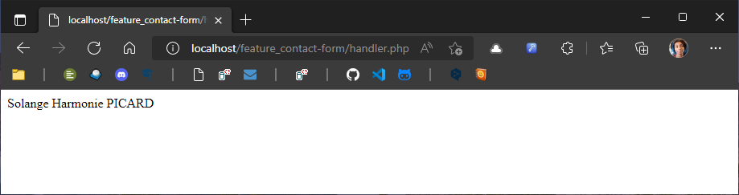

- Vous n'êtes pas très impressionnés ? Normal, ce n'est que le début. Bon, en réalité on ne veut pas afficher pour de vrai des informations dans notre page de traitement. Comme nous l'avons vu précédemment, elle ne doit contenir **que du PHP**. Il n'y a donc pas de `DOCTYPE` dans cette page, etc. d'où l'intérêt de notre fonction `session_start()` que nous avons ouverte sur nos deux pages : nous allons demander à PHP d'afficher le résultat de notre traitement sur notre page `index.php`. Procédons par étape :
    - Tout d'abord, remplacez le `echo` devant `$_POST['data-username'];` par `$_SESSION[] =` : on affecte la valeur `$_POST['data-username'];` à la variable superglobale de session ; 
        - Dans les crochets de `$_SESSION[]`, mettez des *simple quotes* (`'`) et écrivez « *message* » dedans pour donner une clé d'indexation. Le résultat : `$_SESSION['message'] = $_POST['data-username'];` ;
    - Entre le `=` et le `$_POST['data-username'];`, vous allez ouvrir des *simple quotes* pour spécifier que nous allons écrire une *string*, c'est à dire une chaine de caractères. Entre vos *simple quotes*, écrivez « Le nom d'utilisateur saisi est » : l'idée étant d'afficher un message en français confirmant le nom d'utilisateur saisi. Sauf que... ça ne fonctionnera pas en l'état...
        - Dans la phrase « Le nom d'utilisateur saisi est », il y a une apostrophe après le  « d ». Or une apostrophe, c'est une *simple quote* ! Donc la *simple quote* s'ouvre avant le mot « le » mais se referme après le « d' ». Vous allez donc devoir « échapper » votre apostrophe en séparant le « d » et l'apostrophe par une anti-slash « \ ». Votre phrase devrait ressembler à ça : `'Le nom d\'utilisateur saisi est'` ;
    - Ce n'est pas fini ! Entre votre *simple quote* fermante et `$_POST['data-username'];`, il va falloir concaténer. En PHP, l'opérateur de concaténation est le point. Vous devriez donc écrire quelque chose comme ça : `'Le nom d\'utilisateur saisi est ' . $_POST['data-username'];` ;
        - Remarquez l'espace entre le mot « est » et la *simple quote*. Il n'est pas là par hasard ! Si vous ne mettez pas d'espace, la concaténation se fera entre la lettre « t » et la donnée saisie dans le formulaire, de qui ne sera pas très esthétique...
    - Enfin, il vous reste à écrire sur la ligne suivante la fonction `header()` et à lui passer en paramètre `'Location : index.php'` ;
    - Le résultat final devrait ressembler à ça : 

**handler.php**
```php
<?php 

session_start(); 

$_SESSION['message'] = 'Le nom d\'utilisateur saisi est ' . $_POST['data-username'];

header('Location: index.php');

// EOF
```

> Notez que le code est plus court que les explications. 🤣

- Maintenant, affichons notre message dans `index.php`. Pour se faire, sous votre balise `</form>`, ouvrez une balise `<p>` et fermez-la avec `</p>`. À l'intérieur, tapez `<?=` : c'est un raccourci pour écrire `<?php echo`. Ensuite, `$_SESSION['message'];` puis fermez avec ` ?>`. Ça devrait ressembler à ça :

**index.php**
```php
<p>
    <?= $_SESSION['message']; ?>
</p>
```

- Saisissez des données dans vos champs de formulaire, appuyez sur « Envoyer ». Les données sont envoyées à la page de traitement, mais vous ne vous en rendez pas compte ! Et la page `index.php` se recharge et affiche votre message :

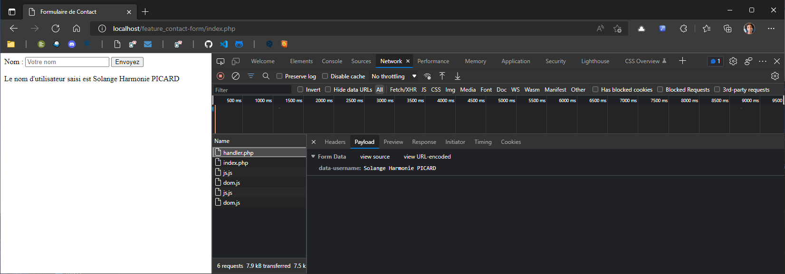

- Satisfaisant, non ? Sauf qu'on va avoir un petit problème supplémentaire. Si vous chargez votre page `index.php` alors qu'aucune donnée n'a encore été soumise via le formulaire, PHP va quand même essayer d'afficher `<?= $_SESSION['message']; ?>`. Vous aurez alors un magnifique message d'erreur de type :

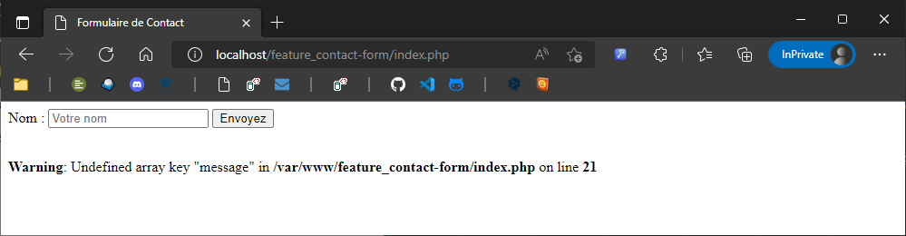

- La solution à ce problème, c'est un concept fondamental en programmation informatique : les conditions ! On va donc écrire notre première condition. Supprimez la ligne `<?= $_SESSION['message']; ?>` entre vos balises `<p>` et `</p>`. À la place, ouvrez et fermez PHP : 

**index.php**
```php
<p>
    <?php
        // Votre code ici
    ?>
</p>
```

- La structure d'une condition est assez simple, elle se compose du mot clé `if` suivi de parenthèses qui prennent en paramètres la vérification à effectuer, et d'accolades pour écrire des instructions. Si la condition passée en paramètre se vérifie, l'instruction s'exécute : 

**index.php**
```php
<p>
    <?php
            if(/* la vérification */){
                /* l'instruction */                
            }
    ?>
</p>
```

- Dans notre cas, on va vérifier la présence d'un message stocké dans la variable superglobale `$_SESSION`. Si `$_SESSION['message']` est vraie, alors on affiche le message avec la fonction `echo`. Sinon, rien ne s'affiche. Pour tester une égalité, on utilise l'opérateur de comparaison `==` (compare les valeurs) ou `===` (comparaison plus stricte : valeur + type). 

> ⚠️ Ne confondez jamais les **opérateurs de comparaison** `==` et `===`, et l'**opérateur d'affectation** `=`. En PHP, `=` ne signifie pas « égal » mais permet d'affecter une valeur à une variable. 

**index.php**
```php
    if($_SESSION === true){
        echo $_SESSION['message'] ;
    } 
```

- En réalité, dans ce cas on peut simplifier en retirant `=== true` : passer `$_SESSION` en paramètre revient à vérifier si `$_SESSION` est vrai. Pour faire le choses proprement, on va mettre une seconde instruction après notre `echo` : on va nettoyer le contenu de `$_SESSION['message']` en lui ré-affectant une chaîne de caractère vide :

**index.php**
```php
    if($_SESSION){
        echo $_SESSION['message'] ;
        $_SESSION['message'] = "";
    }
```

- Testez dans le navigateur en vous connectant à  `localhost/feature_contact-form`. Si il n'y a pas de message d'erreur en dessous de votre formulaire, vous êtes pas mal. Entrez un nom dans votre champs de formulaire, appuyez sur votre bouton `Envoyez`, vous devriez avoir le même résultat que précédemment. Réactualisez la page : si tout s'est bien passé, le message disparaît. 

> ## Ce que nous avons vu jusqu'à présent
> - [X] Il n'y a pas besoin de fermer PHP **si le fichier ne contient que du PHP** (on peut alors indiquer la fin du fichier par `// EOF`)
> - [X] la page de traitement stocke les données envoyées via le formulaire dans la variable superglobale `$_POST`, qui est un `array` qui associe comme valeur la donnée envoyée à une clé qui correspond à l'attribut `name` du champs de formulaire. Par exemple, la donnée renseignée dans le champs de formulaire `<input type="text" name="data-username">` sera récuprée avec `$_POST['data-username']`
> - [X] `$_POST` et `$_SESSION` sont des variables superglobales
> - [X] Ce qui est écrit entre *simple quotes* est de type *string* (chaîne de caractère)
> - [X] une instruction se termine par `;`
> - [X] `echo` permet d'afficher quelque chose
>   - [X] `<?= ?>` est un raccourci que l'on utilise dans les fichiers HTML pour `<?php echo ?>` pour afficher quelque chose qui tient sur une seule ligne
> - [X] `=` est un opérateur d'affection
> - [X] `==` et `===` sont des opérateurs de comparaison
> - [X] `if(){}` est la structure d'une condition
> - [X] `session_start();` est une fonction qui permet de démarrer une session
> - [X] Ce qui est écrit entre parenthèses est le paramètre d'une fonction
> - [X] `header();` est une fonction qui prend en paramètre la *string* `'Location: chemin/de/la/page/de/destination.php'` et permet de faire automatiquement la redirection

## L'envoi du mail en PHP

- Si vous avec réussi le défi « Un peu de pratique » un peu plus haut dans ce tutoriel, vous devez avoir un fichier `index.php` qui ressemble à ça : 

**index.php**

```html
<?php session_start(); ?>

<!DOCTYPE html>
<html lang="fr">
<head>
    <meta charset="UTF-8">
    <meta http-equiv="X-UA-Compatible" content="IE=edge">
    <meta name="viewport" content="width=device-width, initial-scale=1.0">
    <meta name="description" content="Un formulaire de contact en PHP/SQL.">
    <title>Formulaire de Contact</title>
</head>
<body>
    
    <form action="handler.php" method="post">
        <label for="field-name">Nom : </label>
        <input type="text" name="data-username" id="field-name" placeholder="Votre nom">
        <label for="input-email">Email</label>
        <input type="text" name="data-email" id="input-email">
        <label for="input-subject">Subject</label> 
        <input type="text" name="data-subject" id="input-subject" />
        <label for="input-message">Message</label> 
        <textarea name="data-message" id="input- message"></textarea>
        <input type="submit" value="Envoyez">
    </form>

    <p>
        <?php
            if($_SESSION){
                echo $_SESSION['message'] ;
                $_SESSION['message'] = "";
            }
        ?>
    </p>

</body>
</html>
```

- Testez dans un navigateur : 

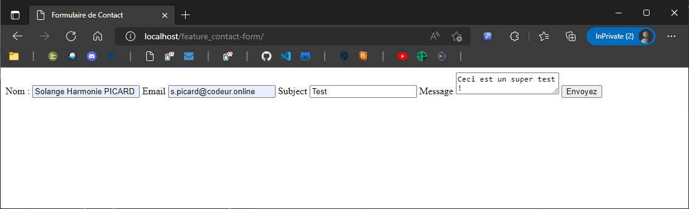

- Pour la suite du tuto, assurez-vous que MailDev est lancé. Dans la barre URL de votre navigateur, tapez :

```
http://127.0.0.1:1080
```

- Vous devriez avoir ce résultat :

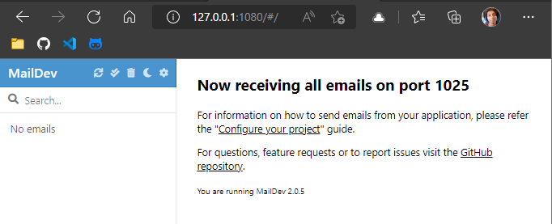

- Si ce n'est pas le cas, dans votre terminal Debian, tapez : 

```
maildev --ip 127.0.0.1
```

- Passons aux choses sérieuses. Dans votre fichier `handler.php`, juste après la fonction `session_start`, créez un `if`, et mettez le `$_SESSION` et la fonction `header` dans ce `if` :

**handler.php**
```php
<?php 

session_start(); 

if(){

    $_SESSION['message'] = 'Le nom d\'utilisateur saisi est ' . $_POST['data-username'];

    header('Location: index.php');

}

// EOF
```

- Maintenant il faut écrire une condition en paramètre du `if`. Ce qu'on veut tester, c'est que les champs sont configurés et qu'ils sont « différents de vide » (je sais, en français ça fait nulle). Pour chaque champs, il va donc falloir utiliser les fonctions `isset()` et `!empty()` (`!` signifie « différent de », ou « le contraire de »). Passez les données de chaque champs en paramètre de ces deux fonctions. Au passage, changez le message. Ça devrait ressembler à ça :

**handler.php**
```php
isset('data-username') && !empty('data-username') 
&& isset('data-email') && !empty('data-email') 
&& isset('data-subject') && !empty('data-subject')
&& isset('data-message') && !empty('data-message')
```

- Du coup, il faut mettre ça en paramètre de votre `if()` : 

**handler.php**
```php
<?php 

session_start(); 

if(isset($_POST['data-username']) && !empty($_POST['data-username']) 
&& isset($_POST['data-email']) && !empty($_POST['data-email']) 
&& isset($_POST['data-subject']) && !empty($_POST['data-subject'])
&& isset($_POST['data-message']) && !empty($_POST['data-message'])){

    $_SESSION['message'] = 'Ça marche !';

    header('Location: index.php');

}

// EOF
```

- Et rajoutez un `else` : si l'une des conditions de votre `if()` n'est pas vérifié, le script ne pourra pas entrer dans les instructions de votre `if()` (les instructions, c'est tout ce qui est entre les accolades `{}` après les paramètres `()`), et exécutera les instructions du `else`. Écrivez quelque chose comme ça : 

**handler.php**
```php
<?php 

session_start(); 

if(isset($_POST['data-username']) && !empty($_POST['data-username']) 
&& isset($_POST['data-email']) && !empty($_POST['data-email']) 
&& isset($_POST['data-subject']) && !empty($_POST['data-subject'])
&& isset($_POST['data-message']) && !empty($_POST['data-message'])){

    $_SESSION['message'] = 'Ça marche !';

    header('Location: index.php');

} else {

    $_SESSION['message'] = 'Remplissez tous les champs !';

    header('Location: index.php');

}

// EOF
```

- Testez dans un navigateur, en remplissant tous les champs, vous devriez obtenir le message « `Ça marche !` » :


- Puis faites le même test en laissant un seul champs vide avant d'appuyez sur le bouton `Envoyez`, puis recommencez en laissant un autre champs vide, puis en laissant plusieurs champs vide, etc. À chaque fois, vous devriez obtenir « `Remplissez tous les champs !` ». Si c'est le cas, c'est que votre script fonctionne :

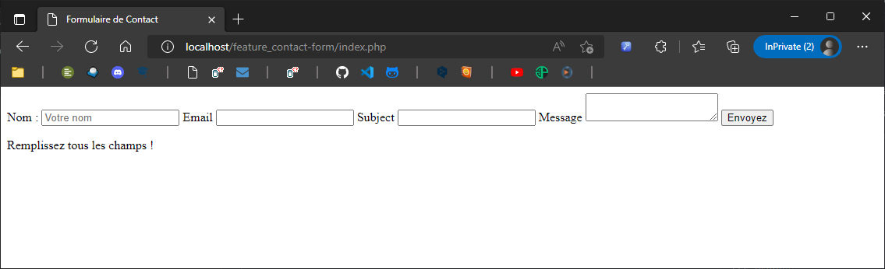

- Ok, on va maintenant manipuler ces données en PHP. L'objectif, c'est d'envoyer un mail contenant les données. La première étape, c'est de stocker dans des variables les données passées par les champs de formulaire, récupérées via les `$_POST[]`. Entre la condition et la variable superglobale de session qui permet d'enregistrer le message de succès, déclarez des variables et affectez-leur les datas :

**handler.php**
```php
<?php 

session_start(); 

if(isset($_POST['data-username']) && !empty($_POST['data-username']) 
&& isset($_POST['data-email']) && !empty($_POST['data-email']) 
&& isset($_POST['data-subject']) && !empty($_POST['data-subject'])
&& isset($_POST['data-message']) && !empty($_POST['data-message'])){

    $contact_username = strip_tags($_POST["data-username"]);
	$contact_email = strip_tags($_POST["data-email"]);
	$contact_subject = strip_tags($_POST["data-subject"]);
	$contact_message = strip_tags($_POST["data-message"]);    

    $_SESSION['message'] = 'Ça marche !';

    header('Location: index.php');

} else {

    $_SESSION['message'] = 'Remplissez tous les champs !';

    header('Location: index.php');

}

// EOF
```

- Du point de vue de l'utilisateur qui teste le champs de formulaire, rien n'a changé, par contre vous pouvez commenter temporairement le ` header('Location: index.php')` et faire des `echo` des variables pour constater que vous récupérez bien les données envoyées via le formulaire. Rajoutez après la déclaration des variables : 

**handler.php**
```php
    echo 'Nom : ' . $contact_username . '<br> Email :' . $contact_email . '<br> Sujet :' . $contact_subject . '<br> Message :' . $contact_message ;    

    // $_SESSION['message'] = 'Ça marche !';

    // header('Location: index.php');
```

- Puis remplissez vos champs de formulaire, et appuyez sur `Envoyer`. Vous devriez obtenir un résultat comme celui-là :


- Ça marche ! Bon, supprimez la ligne `echo` ou *a minima* commentez-là, elle ne servait qu'à vérifier qu'on récupérait bien les valeurs. On va déclarer deux autres variables. Une variable ` $mail_recipient` à laquelle on affecte comme valeur l'adresse email de celui qui doit recevoir les messages envoyés via le formulaire (en l'occurence vous), et les `headers` du mail, qui vous permettront à la réception du mail de savoir qui vous l'a envoyé :

**handler.php**
```php
    $mail_recipient  = "s.picard@codeur.online";
    $mail_headers = "From: " . $contact_username . "<". $contact_email .">\r\n";
```

- La fonction en PHP qui permet de gérer les mails s'appelle `mail()` (plutôt explicite, non ?). On va lui passer 4 paramètres, qui sont en fait les variables qu'on a déjà préparé :

**handler.php**
```php
    mail($mail_recipient, $contact_subject, $contact_message, $mail_headers) ;
```

- On va l'encadrer d'une condition `if/else` : si tout se passe bien, on remplit la superglobale de session avec un message de succès, sinon avec un message d'erreur, et on termine par un `header('Location: ')` :

**handler.php**
```php
    if(mail($mail_recipient, $contact_subject, $contact_message, $mail_headers)) {
        $_SESSION['message'] = "Message envoyé !";
    } else {
        $_SESSION['message'] = "Le message n'a pas été envoyé...";
    }

    header('Location: index.php');
```

- Le code complet du fichier `handler.php` devrait maintenant ressembler à ça : 

**handler.php**
```php
<?php 

session_start(); 

if(isset($_POST['data-username']) && !empty($_POST['data-username']) 
&& isset($_POST['data-email']) && !empty($_POST['data-email']) 
&& isset($_POST['data-subject']) && !empty($_POST['data-subject'])
&& isset($_POST['data-message']) && !empty($_POST['data-message'])){

    $contact_username = strip_tags($_POST["data-username"]);
	$contact_email = strip_tags($_POST["data-email"]);
	$contact_subject = strip_tags($_POST["data-subject"]);
	$contact_message = strip_tags($_POST["data-message"]);

    // echo 'Nom : ' . $contact_username . '<br> Email :' . $contact_email . '<br> Sujet :' . $contact_subject . '<br> Message :' . $contact_message ;   

    $mail_recipient  = "s.picard@codeur.online";
    $mail_headers = "From: " . $contact_username . "<". $contact_email .">\r\n";
    
    if(mail($mail_recipient, $contact_subject, $contact_message, $mail_headers)) {
        $_SESSION['message'] = "Message envoyé !";
    } else {
        $_SESSION['message'] = "Le message n'a pas été envoyé...";
    }

    header('Location: index.php');

} else {

    $_SESSION['message'] = 'Remplissez tous les champs !';

    header('Location: index.php');

}

// EOF
```

- Et pour voir le résultat, on va (enfin !) devoir utiliser MailDev, que vous avez normalement installé suite à votre installation de PHP en suivant [ce tuto](https://github.com/SolangeHarmoniePICARD/doc_wsl2-debian-fr). Normalement, MailDev se lance au moment où vous démarrez votre terminal Debian. Si pour une quelconque raison il n'est pas lancé, vous pouvez le relancer en tapant dans un terminal : 

```
maildev --ip 127.0.0.1
```

- Puis dans la barre d'URL de votre navigateur : 

```
http://127.0.0.1:1080
```


- Testez votre formulaire de contact. La petite subtilité, c'est que MailDev intercepte le mail envoyé (pour éviter qu'une vraie boîte mail soit spamée durant une phase de test d'un formulaire de contact en PHP... malin non ?). Donc peu importe la valeur de votre variable `$mail_recipient`, tant que vous développez en local, rien n'arrivera dans votre boîte mail. Tout se passe à `http://127.0.0.1:1080` : 

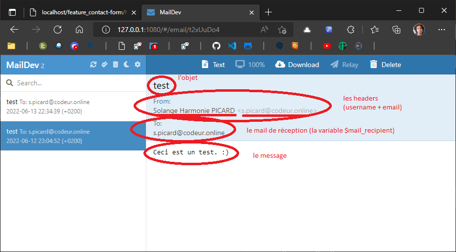


## L'insertion en base de données 

- Dans la barre d'URL de votre navigateur, tapez :

```
http://localhost/adminer/
```

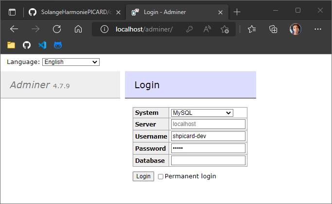

- Connectez-vous, puis créez une nouvelle base de données : 

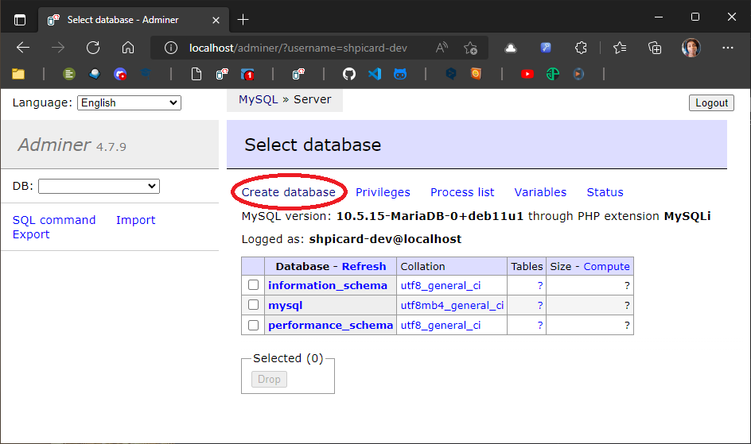

- Nommez-la `db_contact-form` et choisissez comme interclassement `utf8_general_ci` : 


- Nous allons créer une nouvelle table pour stocker les messages envoyés via notre formulaire de contact :

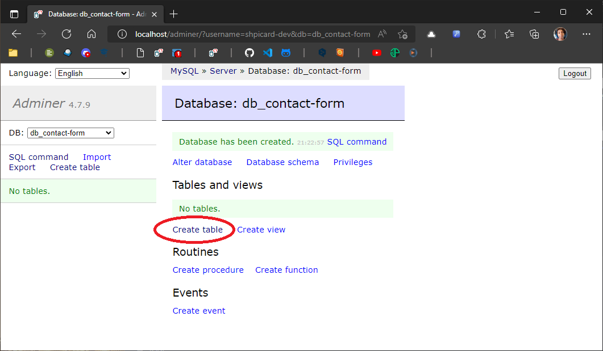

- La table devra s'appeler `tbl_contacts`, elle aura pour moteur de stockage InnoDB, comme interclassement `utf8mb4_general_ci`, et elle sera composée de 5 champs :  `contact_id` (de type `int` et qui s'auto-incrémente), `contact_username`, `contact_email`, `contact_subject` et `contact_message`. Paramétrez comme suit, puis sauvegardez la nouvelle table : 

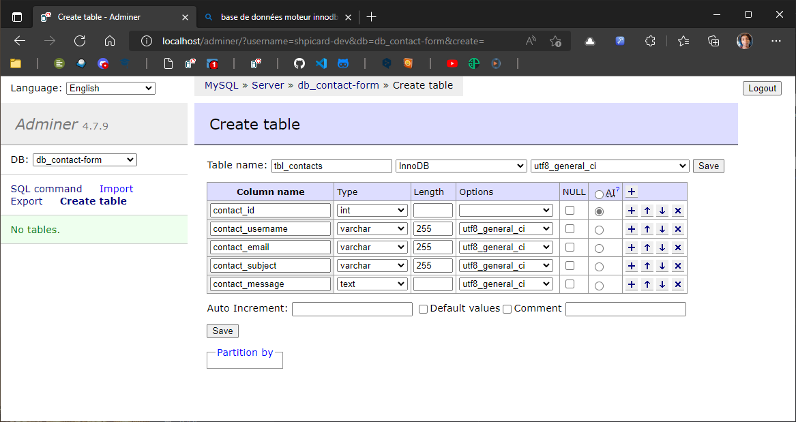

- Dans un terminal, tapez :

```
touch /var/www/feature_contact-form/db_contact-form.sql
```

- Dans le fichier `db_contact-form.sql`, collez :

```SQL
SET NAMES utf8;
SET time_zone = '+00:00';
SET foreign_key_checks = 0;
SET sql_mode = 'NO_AUTO_VALUE_ON_ZERO';

DROP TABLE IF EXISTS `tbl_contacts`;
CREATE TABLE `tbl_contacts` (
  `contact_id` int(11) NOT NULL AUTO_INCREMENT,
  `contact_username` varchar(255) NOT NULL,
  `contact_email` varchar(255) NOT NULL,
  `contact_subject` varchar(255) NOT NULL,
  `contact_message` text NOT NULL,
  PRIMARY KEY (`contact_id`)
) ENGINE=InnoDB DEFAULT CHARSET=utf8;
```

- Puis enregistrez. Si vous avez besoin de re-créer votre table, dans Adminer, placez-vous dans la base de données, cliquez sur `Commande SQL`, collez ces lignes et exécutez la requête : 

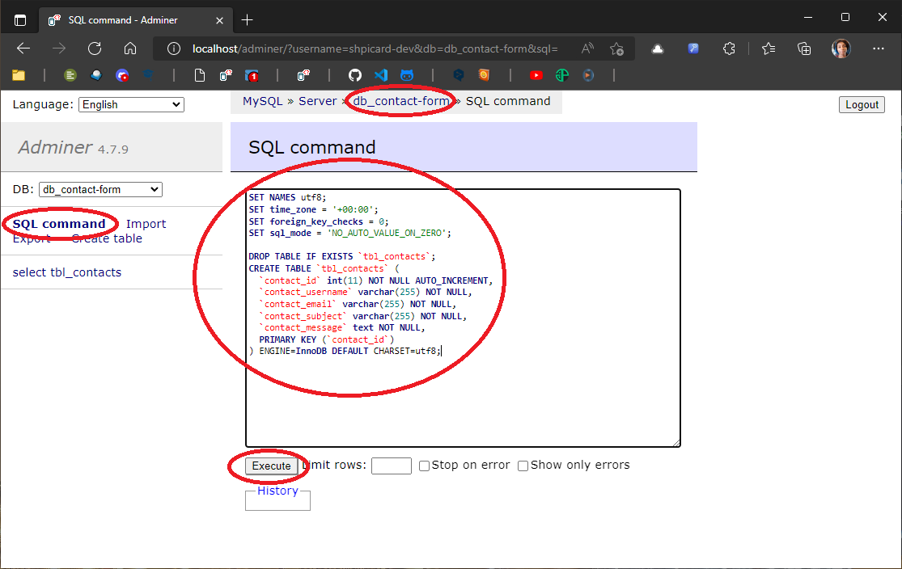

⚠️ `DROP` signifie « supprimer » : si vous avez déjà des données sauvegardées dans votre base de données, vous les écraserez...

- Dans un terminal, tapez :

```
touch /var/www/feature_contact-form/db-connect.php
```

- Dans `db-connect.php`, tapez (changez `your-username` et `your-password` avec vos informations de connexion : ce sont les mêmes que celles que vous utilisez pour vous connecter à Adminer) : 

**db-connect.php**
```php
$db_servername = "localhost";
$db_dbname = "db_contact-form";
$db_username = "your-username";
$db_password = "your-password";

try {
  $db = new PDO("mysql:host=$db_servername;dbname=$db_dbname", $db_username, $db_password);
  // set the PDO error mode to exception
  $db->setAttribute(PDO::ATTR_ERRMODE, PDO::ERRMODE_EXCEPTION);
  //echo "Connected successfully";
} catch(PDOException $e) {
  echo "Connection failed: " . $e->getMessage();
}
```

- Dans `handler.php`, avant le  `header('Location: ')`, vous allez faire une requête préparée (vous écrivez votre requête SQL, puis `prepare`, `bindValue`, `execute`) : 

**handler.php**
```php
require_once('db-connect.php');

    $sql = 'INSERT INTO `tbl_contacts` (`contact_username`, `contact_email`, `contact_subject`, `contact_message`) VALUES (:contact_username, :contact_email, :contact_subject, :contact_message)';
    $query = $db->prepare($sql);
    $query->bindValue(':contact_username', $contact_username, PDO::PARAM_STR);
    $query->bindValue(':contact_email', $contact_email, PDO::PARAM_STR);
    $query->bindValue(':contact_subject', $contact_subject, PDO::PARAM_STR);
    $query->bindValue(':contact_message', $contact_message, PDO::PARAM_STR);
    $query->execute();
```

- Testez votre formulaire de contact, normalement dans MailDev vous recevez le mail, et dans Adminer, entrez dans `tbl_contacts` puis dans `Select data` :

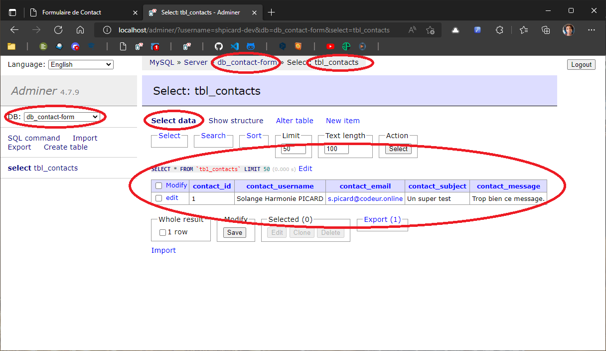


> Défi :  modifiez la structure de votre base de données pour enregistrer la date et l'heure à laquelle le message a été envoyé.


## L'affichage des données contenues en base de données 

- Dans votre terminal Debian, tapez :

```touch /var/www/feature_contact-form/view.php```

- À la fin de `index.php`, placez un lien vers votre page `view.php` :

**index.php**
```html
    <div>
        <a href="view.php"><button>Afficher les messages</button></a>
    </div>
```

- Dans `view.php`, commencez par ouvrir votre balise `<?php`, connectez-vous à la base de données en utilisant la fonction  `require_once()` et en lui passant en paramètre le fichier `'db-connect.php'`, puis faites une requête préparée pour récupérer toutes les données de la table `tbl_contacts` :

**view.php**
```php
<?php

    require_once('db-connect.php');

    $sql = 'SELECT * FROM `tbl_contacts`';
    $query = $db->prepare($sql);
    $query->execute();
    $contacts = $query->fetchAll(PDO::FETCH_ASSOC);

?>
```

- Toutes vos données sont contenus dans un tableau associatif stocké dans la variable `$contacts`, on l'utilisera pour afficher les données dans une boucle. En attendant, après la balise fermante `?>`, allez à la ligne et générez un `!DOCTYPE`. Profitez-en pour mettre un lien qui permet de naviguer jusqu'à `index.php` :

**view.php**
```html
<!DOCTYPE html>
<html lang="fr">
<head>
    <meta charset="UTF-8">
    <meta http-equiv="X-UA-Compatible" content="IE=edge">
    <meta name="viewport" content="width=device-width, initial-scale=1.0">
    <meta name="description" content="La page d'affiichage des messages du formulaire de contact en PHP/SQL.">
    <title>Formulaire de Contact - Liste des messages</title>
</head>
<body>

    <h1>Messages du formulaire de contact</h1>

        <!-- Votre code PHP ici -->

    <div>
        <a href="index.php"><button>Retour</button></a>
    </div>

</body>
</html>
```

- Dernière étape, mais non des moindre : on va ouvrir une boucle `foreach` qui pour chaque ligne de `tbl_contacts` stocké dans la variable `$contacts` (la clé), va remplir la variable `$contact` avec les données de la ligne. On fait apparaître ces données avec le raccourci PHP de `echo` qu'on a déjà vu, `<?= /* la variable ici */ ?>`, imbriqués dans des balises html, puis on ferme la boucle `foreach` :

**view.php**
```php
    <?php foreach($contacts as $contact){ ?>
        
        <h2><?= $contact['contact_subject'] ?></h2>
        <p>Auteur : <?= $contact['contact_username'] ?></p>
        <p>Email : <?= $contact['contact_email'] ?></p>
        <p>Message : <?= $contact['contact_message'] ?></p>

    <?php } ?>
```

- Le code complet de la page `view.php` :

**view.php**
```html
<?php

require_once('db-connect.php');

$sql = 'SELECT * FROM `tbl_contacts`';
$query = $db->prepare($sql);
$query->execute();
$contacts = $query->fetchAll(PDO::FETCH_ASSOC);

?>

<!DOCTYPE html>
<html lang="fr">
<head>
    <meta charset="UTF-8">
    <meta http-equiv="X-UA-Compatible" content="IE=edge">
    <meta name="viewport" content="width=device-width, initial-scale=1.0">
    <meta name="description" content="La page d'affiichage des messages du formulaire de contact en PHP/SQL.">
    <title>Formulaire de Contact - Liste des messages</title>
</head>
<body>
    
<h1>Messages du formulaire de contact</h1>

    <?php foreach($contacts as $contact){ ?>
        
        <h2><?= $contact['contact_subject'] ?></h2>
        <p>Auteur : <?= $contact['contact_username'] ?></p>
        <p>Email : <?= $contact['contact_email'] ?></p>
        <p>Message : <?= $contact['contact_message'] ?></p>

    <?php } ?>

    <div>
        <a href="index.php"><button>Retour</button></a>
    </div>

</body>
</html>

```

- Le résultat : 

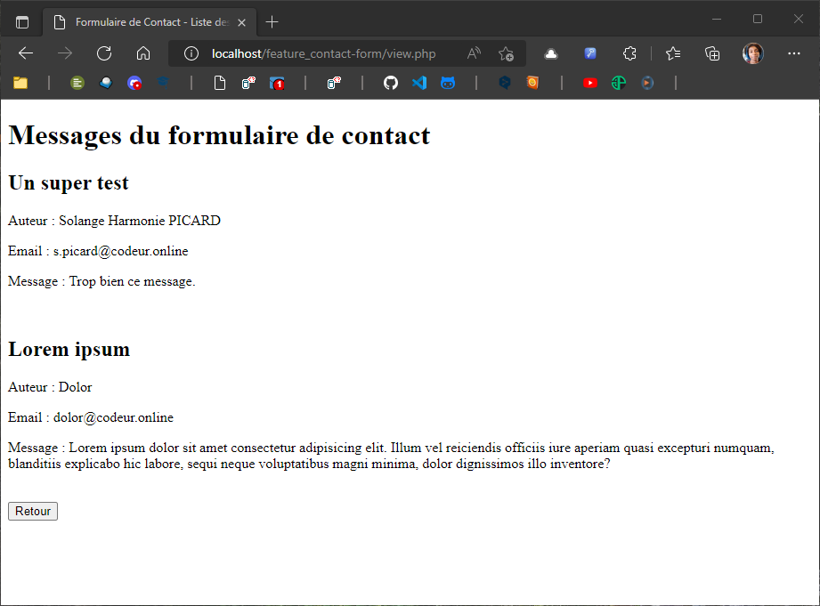

## Un peu de cosmétique avant de passer à la suite 😄

> On a actuellement 2 pages d'affichages contenant du HTML (`index.php` et `view.php`), et dans chacune de ces pages, on a un Doctype. C'est bien, mais on pourrait optimiser pour éviter au maximum de dupliquer du code. 

- Positionnons-nous dans `/var/www/feature_contact-form/` :

```
cd /var/www/feature_contact-form/
```

- On va commencer par créer 2 nouveaux fichiers : 

```
touch include_header.php include_footer.php
```

- Dans `include_header.php`, on va mettre tout ce qui précède l'ouverture de la balide `<body>` dans nos pages d'affichage, et la balise ouvrante `<body>` elle-même :

**include_header.php**
```html
<?php session_start(); ?>

<!DOCTYPE html>
<html lang="fr">
<head>
    <meta charset="UTF-8">
    <meta http-equiv="X-UA-Compatible" content="IE=edge">
    <meta name="viewport" content="width=device-width, initial-scale=1.0">
    <meta name="description" content="Un formulaire de contact en PHP/SQL.">
    <title>Formulaire de Contact</title>
</head>
<body>
```

- Réciproquement, dans `include_footer.php`, on met tout ce qui termine notre fichier, bien entendu les balises fermantes `</body>` et `</html>` mais aussi pourquoi pas notre variable superglobale de session qui gère les messages si il y en a :

**include_footer.php**
```html
    <p>
        <?php
            if($_SESSION){
                echo $_SESSION['message'] ;
                $_SESSION['message'] = "";
            }
        ?>
    </p>

</body>
</html>
```

- Il ne nous reste plus qu'à retirer dans `index.php` et dans `view.php` ce qu'on a mis dans nos includes, et à les appeler à la place :

```
<?php include 'include_header.php'; ?>
```

- et par :

```
<?php include 'include_footer.php'; ?>
```

- Du coup, votre fichier `index.php` devrait ressembler à ça : 

```html
<?php include 'include_header.php'; ?>
    
    <form action="handler.php" method="post">
        <label for="field-username">Nom : </label>
        <input type="text" name="data-username" id="field-username" placeholder="Votre nom">
        <label for="input-email">Email</label>
        <input type="text" name="data-email" id="input-email" placeholder="Votre e-mail">
        <label for="input-subject">Sujet</label> 
        <input type="text" name="data-subject" id="input-subject">
        <label for="input-message">Message</label> 
        <textarea name="data-message" id="input-message"></textarea>
        <input type="submit" value="Envoyez">
    </form>

    <p>
        <a href="view.php"><button>Afficher les messages</button></a>
    </p>

<?php include 'include_footer.php'; ?>
```

> On est pas mal ! Mais on va rapidement avoir un autre petit problème : pour le moment on a un seul fichier de traitement qu'on a appelé `handler.php`, un seul fichier d'affichage qu'on a appelé `view.php`... mais nous allons vite en avoir d'autres ! « handler » et « view » vont donc devoir devenir des préfixes, un peu comme « include_ » !

- Pour renommer un fichier, on utilise la commande `mv` dans un terminal, suivi du nom du fichier à renomer, puis de son futur nom. Normalement, vous êtes déjà dans `/var/www/feature_contact-form/`, sinon un petit `cd` pour vous repositionner dedans, puis : 

```
mv view.php view_contact-form-messages.php
```

> Ça vous semble être un nom de fichier à rallonge ? C'est le cas. Mais il a l'avantage d'être explicite. Pour débuter, c'est la bonne façon de faire ! 

- Modifiez aussi le nom de la page de traitement : 

```
mv handler.php handler_contact-form.php
```

- Et puis pour des questions de cohérence, on va aussi modifier `db-connect.php` et `db-env.php` : 

```
mv db-connect.php db_connect.php
```

- Et : 

```
mv db-env.php db_env.php
```

> ⚠️ Bon, il va falloir passer tous vos fichiers en revue et modifier tous les noms de fichier en dur dans le code. Bon courage. Si vous en ratez un, rien de bien grave, en testant votre projet PHP vous dira votre erreur et vous n'aurez qu'à modifier en conséquence... 😅 

- Normalement, votre répertoire devrait ressembler à ceci : 

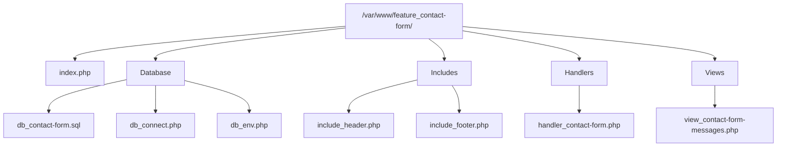

> ⚠️ Sur le schéma, j'ai rajouté `Database`, `Includes`, `Handlers` et `Views` pour que vous compreniez bien, mais évidemment ça ne correspond pas à des dossiers, tous vos fichiers sont dans `/var/www/feature_contact-form/`.

## Le *Back-office*

### L'enregistrement d'un nouvel utilisateur

> Un peu de sécurité : vous voulez vraiment que n'importe puisse lire les messages qui vous sont envoyés depuis votre superbe formulaire de contact ?! Bien sûr que non ! Créez donc un formulaire de connexion à la page `view.php` ! Là ça devient compliqué : il vous faudra une nouvelle table pour inscrire des administrateurs ayant *a minima* un pseudo et un mot de passe, puis vérifiez que le mot de passe du formulaire corresponde au mot de passe en base de données.

- Commençons par créer une page d'affichage, qui va contenir notre formulaire d'inscription :

```
touch view_user-registration.php
```

- Et sa page de traitement : 

```
touch handler_user-registration.php
```

- Dans la *view*, on peut commencer par mettre nos *includes* : 

**view_user-registration.php**
```html
<?php include 'include_header.php'; ?>

<!-- Notre formulaire d'inscription ici... -->

<?php include 'include_footer.php'; ?>
```

- Et dans `index.php`, on va remplacer le lien vers la page d'affichage des messages par un lien vers la page d'inscription : 

**index.php**

```html
    <p>
        <a href="view_user-registration.php">
            <button>S'inscrire</button>
        </a>
    </p>
```

- Dans *view_user-registration.php*, on crée notre formulaire d'inscription. On va découvrir un nouveau type de champs de formulaire, le type `password` qui a notamment la particularité de masquer ce qu'on écrit : 

**view_user-registration.php**

```html
<?php include 'include_header.php'; ?>

    <form action="handler_user-registration.php" method="post">

        <div>
            <label for="input-username">Nom d'utilisateur:</label>
            <input type="text" id="input-username" name="data-username">
        </div>

        <div>
            <label for="input-email">Email:</label>
            <input type="email" id="input-email" name="data-email">
        </div>

        <div>
            <label for="input-password">Mot de passe:</label>
            <input type="password" id="input-password" name="data-password">
        </div>

        <div>
            <label for="input-pswdConfirmation">Confirmez le mot de passe :</label>
            <input type="password"  id="input-pswdConfirmation" name="data-pswdConfirmation">
        </div>

        <div>
            <input type="submit" id="form_submit" value="S'inscrire">
        </div>

    </form>

<?php include 'include_footer.php'; ?>
```

- C'est bien d'avoir un formulaire pour récupérer des données, mais il nous faut une table dans laquelle les écrire. Allez dans Adminer en tapant `http://localhost/adminer/` dans la barre d'URL de votre navigateur, entrez dans la base de données `db_contact-form`, cliquez sur `Requête SQL` et tapez : 

```sql
SET NAMES utf8;
SET time_zone = '+00:00';
SET foreign_key_checks = 0;
SET sql_mode = 'NO_AUTO_VALUE_ON_ZERO';

DROP TABLE IF EXISTS `tbl_users`;
CREATE TABLE `tbl_users` (
  `user_id` int(11) NOT NULL AUTO_INCREMENT,
  `user_username` varchar(255) NOT NULL,
  `user_password` varchar(255) NOT NULL,
  `user_email` varchar(255) NOT NULL,
  PRIMARY KEY (`user_id`),
  UNIQUE KEY `user_email` (`user_email`)
) ENGINE=InnoDB DEFAULT CHARSET=utf8;

```

- Exécutez la requête. Vous pouvez vous repositionner dans `db_contact-form`. Exportez la totalité de votre base, et copiez le résultat à la place du contenu dans `db_contact-form.sql`.

- Dans *handler_user-registration.php*, on commence par vérifier que les champs de formulaire ont bien été soumis et qu'ils ne sont pas vides : 

**handler_user-registration.php**
```php
<?php

session_start();

  if(isset($_POST['data-username']) && !empty($_POST['data-username']) 
    && isset($_POST['data-email']) && !empty($_POST['data-email']) 
    && isset($_POST['data-password']) && !empty($_POST['data-password']) 
    && isset($_POST['data-pswdConfirmation']) && !empty($_POST['data-pswdConfirmation'])){

        echo 'Ça marche ! 🥳';

    } else {
        $_SESSION['message'] = 'Completez tous les champs !';
        header('Location: view_user-registration.php'); 
    }

?>
```

- Dans ce premier `if`, on imbrique ensuite un second `if` pour vérifier que le mot de passe et la confirmation du mot de passe correspondent :

**handler_user-registration.php**
```php
    if ($_POST['data-password'] == $_POST['data-pswdConfirmation']) {
            
        echo 'Ça marche ! 🥳';

    } else {

        $_SESSION['message'] = 'Les mots de passe ne correspondent pas...';
        header('Location: view_user-registration.php'); 

    }
```

- Dans ce second `if`, on stocke les données dans des variables, et on en profite au passage pour nettoyer les données avec la fonction `strip_tags()`. Pour le mot de passe, ça va se faire en 2 temps, puisqu'il faut aussi le crypter avec la fonction `password_hash()` :

**handler_user-registration.php**
```php
    $user_username = strip_tags($_POST['data_username']);
    $user_email = strip_tags($_POST['data_email']);
    $user_unencrypted_password = strip_tags($_POST['data_password']);
    $user_encrypted_password = password_hash($user_unencrypted_password, PASSWORD_DEFAULT);
```

- Il ne nous reste plus qu'à nous connecter à la base de données, à préparer, faire le bind et exécuter la requête d'insertion :

**handler_user-registration.php**
```php
    require_once('db_connect.php');
    $sql = 'INSERT INTO tbl_users(`user_username`, `user_password`, `user_email`) VALUES(:user_username, :user_password, :user_email)';
    $query = $db->prepare($sql);
    $query->bindValue(':user_username', $user_username, PDO::PARAM_STR);
    $query->bindValue(':user_password', $user_encrypted_password, PDO::PARAM_STR);
    $query->bindValue(':user_email', $user_email, PDO::PARAM_STR);
    $query->execute();
```

- Terminez par un `header(Location : index.php)` pour rediriger sur l'accueil et non sur le formulaire, et rédigez un message dans la variable superglobale de session :

**handler_user-registration.php**
```php
    $_SESSION['message'] = 'Nouvel utilisateur enregistré !';
    header('Location: index.php'); 
```

- Testez votre formulaire d'inscription. Vérifiez dans Adminer, dans `tbl_users`, cliquez sur `Afficher les données`, normalement une nouvelle ligne avec le nouvel utilisateur est apparu. Reste à faire le formulaire de connexion ! En attendant, le code complet de la page `handler_user-registration.php` :

**handler_user-registration.php**
```php
<?php

session_start();

  if(isset($_POST['data-username']) && !empty($_POST['data-username']) 
    && isset($_POST['data-email']) && !empty($_POST['data-email']) 
    && isset($_POST['data-password']) && !empty($_POST['data-password']) 
    && isset($_POST['data-pswdConfirmation']) && !empty($_POST['data-pswdConfirmation'])){

        if ($_POST['data-password'] == $_POST['data-pswdConfirmation']) {

            $user_username = strip_tags($_POST['data-username']);
            $user_email = strip_tags($_POST['data-email']);
            $user_unencrypted_password = strip_tags($_POST['data-password']);
            $user_encrypted_password = password_hash($user_unencrypted_password, PASSWORD_DEFAULT);

            require_once('db_connect.php');
            $sql = 'INSERT INTO tbl_users(`user_username`, `user_password`, `user_email`) VALUES(:user_username, :user_password, :user_email)';
            $query = $db->prepare($sql);
            $query->bindValue(':user_username', $user_username, PDO::PARAM_STR);
            $query->bindValue(':user_password', $user_encrypted_password, PDO::PARAM_STR);
            $query->bindValue(':user_email', $user_email, PDO::PARAM_STR);
            $query->execute();

            $_SESSION['message'] = 'Nouvel utilisateur enregistré !';
            header('Location: index.php'); 

        } else {
            $_SESSION['message'] = 'Les mots de passe ne correspondent pas...';
            header('Location: view_user-registration.php'); 
        }

    } else {
        $_SESSION['message'] = 'Completez tous les champs !';
        header('Location: view_user-registration.php'); 
    }

?>
```

- Et en bonus, le fichier `db_contact-form.sql` : 

**db_contact-form.sql**
```sql
SET NAMES utf8;
SET time_zone = '+00:00';
SET foreign_key_checks = 0;
SET sql_mode = 'NO_AUTO_VALUE_ON_ZERO';

DROP TABLE IF EXISTS `tbl_contacts`;
CREATE TABLE `tbl_contacts` (
  `contact_id` int(11) NOT NULL AUTO_INCREMENT,
  `contact_username` varchar(255) NOT NULL,
  `contact_email` varchar(255) NOT NULL,
  `contact_subject` varchar(255) NOT NULL,
  `contact_message` text NOT NULL,
  PRIMARY KEY (`contact_id`)
) ENGINE=InnoDB DEFAULT CHARSET=utf8;

DROP TABLE IF EXISTS `tbl_users`;
CREATE TABLE `tbl_users` (
  `user_id` int(11) NOT NULL AUTO_INCREMENT,
  `user_username` varchar(255) NOT NULL,
  `user_password` varchar(255) NOT NULL,
  `user_email` varchar(255) NOT NULL,
  PRIMARY KEY (`user_id`),
  UNIQUE KEY `user_email` (`user_email`)
) ENGINE=InnoDB DEFAULT CHARSET=utf8;
```

### Le formulaire de connexion

- Comme pour le formulaire d'inscription, nous pouvons commencer par créer une page d'affichage, qui va contenir notre formulaire de connexion :

```
touch view_user-login.php
```

- Et sa page de traitement : 

```
touch handler_user-login.php
```

- Dans `index.php`, on rajoute le lien vers le formulaire de connexion, à côté deu bouton d'inscription :

**index.php**
```html
<a href="view_user-login.php"><button>Se connecter</button></a>
```

- Dans `view_user-login.php`, on met nos *includes*, on crée un formulaire avec la méthode `post` et `handler_user-login.php` comme action, et un bouton retour :

**view_user-login.php**
```html
<?php include 'include_header.php'; ?>

    <form action="handler_user-login.php" method="post">
        <!-- Le code de votre formulaire ici -->
    </form>
    
    <p>
        <a href="index.php">
            <button>Retour</button>
        </a>
    </p>

<?php include 'include_footer.php'; ?>
```

- Puis nos 3 `input` à l'intérieur de la balise `form`, comme on sait déjà le faire :

**view_user-login.php**
```html
    <div>
        <label for="input-username">Username: </label>
        <input type="text" id="input-username" name="data-username">
    </div>
    <div>
        <label for="input-password">Password: </label>
        <input type="password" id="input-password" name="data-password">
    </div>
    <div>
        <input type="submit" value="Se connecter">
    </div>
```

- Et c'est tout pour la page de formulaire ! Passons à la page de traitement, avec l'ouverture de la balise PHP, le démarrage de la session, le `if` et le `else`, la connexion à la base de données, la requête `SELECT`, le *prepare/execute*, les redirections, la superglobale de session contenant les messages, etc. :

**handler_user-login.php**
```php
<?php 

session_start();

if(isset($_POST['data-username']) && !empty($_POST['data-username']) 
&& isset($_POST['data-password']) && !empty($_POST['data-password'])){

    require_once('db_connect.php');

    $sql = 'SELECT user_id, user_username, user_password FROM tbl_users WHERE user_username = :user_username';
    $query = $db->prepare($sql);
    $query->execute(array('user_username' => $_POST['data-username']));
    $result = $query->fetch();

        /* Votre code ici */

} else {

    $_SESSION['message'] = 'Complétez tous les champs.';
    header('Location: form_user-login.php'); 

}

```

- À partir de maintenant, les choses vont être un peu différente de ce qu'on a vu précédemment. On doit comparer si le mot de passe saisi correspond au mot de passe enregistré en base de données. On utilise pour cela la fonction `password_verify()`, qui prend 2 paramèrtres : le mot de passe saisi, qu'on récupère avec la superglobale `$_POST`, et le mot de passe enregistré en base de données, qu'on a stocké dans la variable `$result` au moment du `fetch()`. On stocke le résultat de la fonction `password_verify()` dans une variable, et on vérifie si c'est variable est vraie. Si le mot de passe saisi n'est pas différent du mot de passe contenu en base de données pour l'utilisateur, on envoie un message de succès via la superglobale de session, puis on fait la redirection vers notre page d'affichage des messages. Sinon, on indique qu'il y a un problème : 

**handler_user-login.php**
```php
    $checking_password = password_verify($_POST['data-password'], $result['user_password']);

        if ($checking_password) {

            $_SESSION['id'] = $result['user_id'];
            $_SESSION['username'] = $result['user_username'];
            $_SESSION['message'] = 'Connexion réussie !';
            header('Location: view_contact-form-messages.php');

        }else{


            $_SESSION['message'] = 'Le nom d\'utilisateur ou le mot de passe sont incorrects.';
            header('Location: view_user-login.php');

        } 

```

- Le code complet de `handler_user-login.php` :

**handler_user-login.php**
```php
<?php 

session_start();

if(isset($_POST['data-username']) && !empty($_POST['data-username']) 
&& isset($_POST['data-password']) && !empty($_POST['data-password'])){

    require_once('db_connect.php');

    $sql = 'SELECT user_id, user_username, user_password FROM tbl_users WHERE user_username = :user_username';
    $query = $db->prepare($sql);
    $query->execute(array('user_username' => $_POST['data-username']));
    $result = $query->fetch();


        $checking_password = password_verify($_POST['data-password'], $result['user_password']);

        if ($checking_password) {

            $_SESSION['id'] = $result['user_id'];
            $_SESSION['username'] = $result['user_username'];
            $_SESSION['message'] = 'Connexion réussie !';
            header('Location: view_contact-form-messages.php');

        }else{


            $_SESSION['message'] = 'Le nom d\'utilisateur ou le mot de passe sont incorrects.';
            header('Location: view_user-login.php');

        } 

} else {

    $_SESSION['message'] = 'Complétez tous les champs.';
    header('Location: view_user-login.php'); 

}
```

### La condition pour bloquer l'accès aux messages si l'on n'est pas connecté

> Ça marche, mais le problème, c'est que si quelqu'un connaît l'url `http://localhost/feature_contact-form/view_contact-form-messages.php`, il accède directement aux messages sans avoir besoin de passer par le formulaire de connexion... Trouvez une solution !

- L'idée, c'est de tester dans `view_contact-form-messages.php` si la variable superglobale de session contient l'index `username`. Pour rappel, dans le fichier `handler_user-login.php`, si le mot de passe saisi par l'utilisateur correspond au mot de passe enregistré en base de données, on remplissait `$_SESSION['username']` avec le `username` contenu en base de données. Donc si la connexion est réussie, la variable superglobale de session contient bien l'index `username`, sinon, on fait un `header('Location: ')` vers la page de connexion, complété d'un message d'erreur. On place tout ça après l'` include 'include_header.php'` et avant la connexion à la base de données :

```php
if($_SESSION['username']){

    echo 'User: ' . $_SESSION['username'] ;

} else {

    $_SESSION['message'] = 'Vous n\'êtes pas connecté !';
    header('Location: view_user-login.php'); 

}
```

- Le fichier `view_contact-form-messages.php` complet : 

**view_contact-form-messages.php**
```php
<?php include 'include_header.php'; ?>

<?php

if($_SESSION['username']){

    echo 'User: ' . $_SESSION['username'] ;

} else {

    $_SESSION['message'] = 'Vous n\'êtes pas connecté !';
    header('Location: view_user-login.php'); 

}

require_once('db_connect.php');

$sql = 'SELECT * FROM `tbl_contacts`';
$query = $db->prepare($sql);
$query->execute();
$contacts = $query->fetchAll(PDO::FETCH_ASSOC);

?>
    
<h1>Messages du formulaire de contact</h1>

    <?php foreach($contacts as $contact){ ?>
        
        <h2>
            <a href="view_contact-message-single.php?contact_id=<?= $contact['contact_id'] ?>"> 
            <?= $contact['contact_subject'] ?>
        </a>
        </h2>


    <?php } ?>
    
    <div>
        <a href="index.php"><button>Retour</button></a>
    </div>

<?php include 'include_footer.php'; ?>

```

### Se déconnecter

- C'est hyper facile ! Bon, déjà, quand on est connecté, on accède à `view_contact-form-messages.php`, donc c'est là qu'on va placer notre bouton de déconnexion. Il devrait ressembler à ça : 

```html
    <a href="handler_user-logout.php"><button>Se déconnecter</button></a>
```

- Évidemment, ça implique de créer le *handler* :

```
touch handler_user-logout.php
```

- C'est un fichier qui fait deux choses : la première, c'est de démarrer la session avec le fameux `session_start()`, qui donne accès à la variable superglobale de session, qui contient déjà plusieurs clés d'index, notamment `username`, `message`, etc. On vide tout ça en affectant la fonction `array()` sans paramètre à la superglobale `$_SESSION`, puis on détruit la session avec `session_destroy();` : 

**handler_user-logout.php**
```php
// User logout
session_start();
$_SESSION = array();
session_destroy();
```

- Ce pourrait être suffisant. Mais bon, niveau UX, un petit message de succès, c'est toujours mieux. Donc on ré-ouvre une session dans la foulée, on met un petit message de succès, et on termine par une redirection : 

**handler_user-logout.php**
```php
// Logout Success Message
session_start();
$_SESSION['message'] = 'Vous êtes déconnecté !';
header('Location: index.php');
```

- Le fichier `handler_user-logout.php` complet : 

**handler_user-logout.php**
```php
<?php 

// User logout
session_start();
$_SESSION = array();
session_destroy();

// Logout Success Message
session_start();
$_SESSION['message'] = 'Vous êtes déconnecté !';
header('Location: index.php');

// EOF
```


> **Défi :** Qu'il y ait un formulaire d'inscription pour un premier utilisateur, c'est bien. Mais dans la logique, si un utilisateur est déjà enregistré, ce devrait être à lui seul que revient le pouvoir d'inscrire d'autres utilisateurs : le bouton d'inscription ne devrait donc plus apparaître...
>
> **Ultime défi :** concevez des interfaces esthétiques ! (ce qui revient à dire, habillez votre squelette avec du css !)

